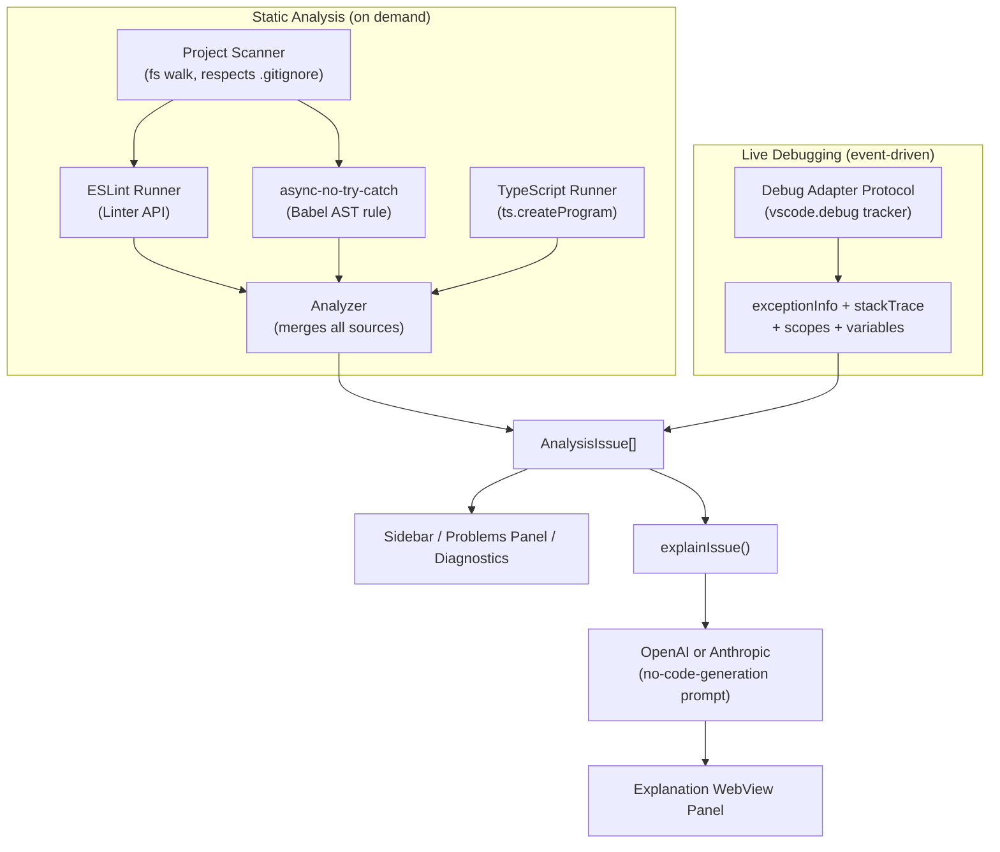

# 🔍 AI Debugging Assistant (Deburger)

**A VS Code extension that actually analyzes your code — with real tools, not reinvented ones — and explains what it finds using AI, without ever writing code for you.**

[]()
[]()
[]()
[](LICENSE)

---

## Table of Contents

- [Why this exists](#why-this-exists)
- [What it does](#what-it-does)
- [Architecture](#architecture)
- [Sample output](#sample-output)
- [Quick Start](#-quick-start)
- [Usage](#-usage)
- [Configuration](#️-configuration)
- [Demo project](#-demo-project)
- [Development](#️-development)
- [Deployment](#-deployment)
- [Known Limitations](#-known-limitations)
- [Roadmap](#️-roadmap)
- [Technical Details](#-technical-details)
- [Contributing](#-contributing)
- [License](#-license)

---

## Why this exists

Most "AI code assistants" either generate code you didn't ask for, or reimplement a worse version of ESLint. This extension deliberately does neither:

- **No code generation.** Ever. It explains problems in plain English; it never writes or suggests a fix. That constraint is enforced in the prompt template itself, not just documentation.
- **No reinvented linting.** Unused variables, deep nesting, and long functions are solved problems — this extension calls ESLint's `Linter` API and the real TypeScript compiler directly, instead of hand-rolling a worse AST walker for things a mature tool already does well.
- **Grounded in what actually happened, not just what the code looks like.** Static analysis can only guess. This extension also watches live debug sessions via the Debug Adapter Protocol, so when your program throws, it can explain the *actual* stack trace and *actual* variable values at the moment of failure — not a guess.

## What it does

| Capability | Source | Severity |
|---|---|---|
| Unused variables, imports, params, functions | ESLint (`no-unused-vars` / `@typescript-eslint/no-unused-vars`) | Warning |
| Functions exceeding 50 lines | ESLint (`max-lines-per-function`) | Info |
| Nesting depth > 4 levels | ESLint (`max-depth`) | Warning |
| Async functions missing try/catch | Custom Babel AST rule — the one check with no ESLint equivalent | Error |
| Real type errors (wrong arg types, missing properties, etc.) | TypeScript compiler (`ts.createProgram`), when a `tsconfig.json` exists | Error |
| Live uncaught exceptions with stack trace + variable state | Debug Adapter Protocol (`exceptionInfo`/`stackTrace`/`scopes`/`variables`) | Error |
| Plain-English explanations of any of the above | OpenAI or Anthropic, via a prompt that explicitly forbids code output | — |

**What it will never do:** generate code fixes, auto-refactor, write new functions, or offer autocomplete. If you're looking for that, this isn't it — by design.

## Architecture



The key design choice: a live runtime exception is mapped onto the exact same `AnalysisIssue` shape a static analysis finding produces. That's why the diagram converges — one UI, one explain pipeline, two very different sources of truth feeding it.

## Sample output

### Real analysis run against the bundled demo project

```
$ node -e "... scanProject + analyzeFiles against demo-project/ ..."

Analysis complete: 22 issues found
  errors: 4  warnings: 17  info: 1

  [warning] demo-project/deepNesting.js:8  (deep-nesting)
      Blocks are nested too deeply (5). Maximum allowed is 4.
  [warning] demo-project/index.js:5  (unused-var)
      'lodash' is assigned a value but never used. Allowed unused vars must match /^_/u.
  [error]   demo-project/index.js:17  (async-no-try-catch)
      Async function 'fetchUserData' should have try/catch error handling
  [info]    demo-project/longFunction.js:3  (long-function)
      Function 'generateComprehensiveReport' has too many lines (71). Maximum allowed is 50.
  [warning] demo-project/unusedVars.js:22  (unused-var)
      'middleName' is defined but never used. Allowed unused args must match /^_/u.
  ... (17 more)
```

### Real test suite run

```
$ npm test

Test Suites: 10 passed, 10 total
Tests:       124 passed, 124 total
Snapshots:   0 total
Time:        9.2s
```

### Screenshots

The sidebar tree view, inline squiggles, and AI explanation webview panel only render inside a live VS Code window — they can't be captured from a terminal-driven environment. If you'd like them here, run the extension via `F5` (see Quick Start below), grab screenshots of the **AI Debugger** sidebar and the explanation panel, and drop them in a `media/` folder — happy to wire them into this README on request.

## 🚀 Quick Start

### Prerequisites
- VS Code 1.85.0 or higher
- Node.js 18.x or higher
- Git

### Installation for Development

```bash
# 1. Clone the repository
git clone https://github.com/kiruthick01/Deburger.git
cd debuggerr

# 2. Install dependencies
npm install

# 3. Compile TypeScript
npm run compile

# 4. Run tests (optional)
npm test  # Should show 124 tests passing

# 5. Launch Extension Development Host
# Press F5 in VS Code, or:
code --extensionDevelopmentPath=/path/to/debuggerr
```

### Try the Demo

```bash
# Open the demo project with intentional issues
code demo-project/

# In VS Code:
# 1. Press Cmd+Shift+P (or Ctrl+Shift+P on Windows/Linux)
# 2. Type "AI Debugger: Run AI Debugging Analysis"
# 3. Press Enter
# 4. View issues in the AI Debugger sidebar
```

## 📖 Usage

### Running Analysis

**Method 1: Command Palette**
1. Open a JavaScript/TypeScript project in VS Code
2. Press `Cmd+Shift+P` (Mac) or `Ctrl+Shift+P` (Windows/Linux)
3. Type: `AI Debugger: Run AI Debugging Analysis`
4. Wait for analysis to complete

**Method 2: Sidebar**
1. Click the AI Debugger icon in the Activity Bar (left sidebar)
2. Click "Run Analysis" button

### Viewing Issues

**Sidebar View:**
- Issues are organized by severity (Error → Warning → Info)
- Click any issue to jump to its location in code
- Issue count badge shows total detected issues

**Problems Panel:**
- Press `Cmd+Shift+M` (Mac) or `Ctrl+Shift+M` (Windows/Linux)
- View all issues alongside other VS Code diagnostics
- Filter by file or severity

**Inline Diagnostics:**
- Squiggly underlines appear in code
- Hover over underlined code to see issue description
- Blue info icon in gutter for informational issues

### Getting AI Explanations

1. Click on any issue in the sidebar
2. Select "Explain This Issue"
3. View detailed explanation in the panel
4. *Note: Requires API key configuration (see Configuration section)*

### Live Exception Detection

This extension also watches your actual debug sessions (any VS Code debugger — Node, Python, etc.) via the Debug Adapter Protocol. When a debug session stops on an uncaught exception, it captures:

- The exception message and type
- The call stack (up to 5 frames)
- Local variable values at the top frame (via the debugger's own `scopes`/`variables` requests — no re-execution, no guessing)

You'll see a notification with an **Explain with AI** action. Clicking it sends the live exception + variable state to the same AI explanation panel used for static analysis issues — but grounded in what actually happened at runtime.

This only works while a debug session is actively running and paused on an exception — it does not scan for exceptions statically, and it depends on the debug adapter supporting standard DAP `exceptionInfo` (most do).

## ⚙️ Configuration

### API Key Setup

The extension requires an LLM API key for AI-powered explanations. Configure it in VS Code settings:

1. Open Settings (`Cmd+,` on macOS, `Ctrl+,` on Windows/Linux)
2. Search for **"AI Debugger"**
3. Enter your API key in `aiDebugger.apiKey`

**Alternative: settings.json**
```json
{
  "aiDebugger.apiKey": "sk-your-api-key-here",
  "aiDebugger.provider": "openai",
  "aiDebugger.model": "",
  "aiDebugger.enableTelemetry": false,
  "aiDebugger.analyzeOnSave": false
}
```

`aiDebugger.provider` selects the LLM backend (`openai` or `anthropic`); `aiDebugger.model` optionally overrides the default model for that provider (e.g. `gpt-4o-mini`, `claude-haiku-4-5-20251001`).

**⚠️ SECURITY WARNING:**
- **NEVER** commit your API key to version control
- Store the key in **User Settings**, not Workspace Settings
- Treat your API key like a password
- Rotate keys immediately if exposed

### Available Settings

| Setting | Type | Default | Description |
|---------|------|---------|-------------|
| `aiDebugger.apiKey` | string | `""` | LLM API key (OpenAI or Anthropic) |
| `aiDebugger.provider` | string | `"openai"` | LLM provider: `openai` or `anthropic` |
| `aiDebugger.model` | string | `""` | Optional model override for the provider |
| `aiDebugger.enableTelemetry` | boolean | `true` | Anonymous usage telemetry (opt-out) |
| `aiDebugger.analyzeOnSave` | boolean | `false` | Auto-run analysis on file save |

### Privacy Notice

**What gets sent to the LLM API:**
- File names and paths from your project
- Code snippets around detected issues (±5 lines context)
- Issue descriptions and metadata
- Project dependency information (from package.json)
- For live exceptions: the stack trace and local variable values captured at the point of failure

**What does NOT get sent:**
- Your entire codebase
- Environment variables or secrets
- Git history or commit messages
- Unrelated files

**Recommendations:**
- ✅ Review your organization's data policies before use
- ✅ Consider self-hosted LLM solutions for proprietary code
- ✅ Remove API key when not needed
- ✅ Use on non-sensitive projects if uncertain

## 🧪 Demo Project

The `demo-project/` folder contains intentionally flawed code to demonstrate the extension:

| File | Issues Demonstrated |
|------|---------------------|
| `index.js` | Async without try-catch, unused imports/variables |
| `deepNesting.js` | Excessive nesting (5-6 levels) |
| `longFunction.js` | Function exceeding 50 lines |
| `unusedVars.js` | Unused imports, variables, parameters, functions |

**Expected Results:** 22 issues (4 errors, 17 warnings, 1 info) — see [Sample output](#sample-output) above for the real run. No `tsconfig.json` in the demo project, so TypeScript compiler diagnostics don't apply here.

## 🛠️ Development

### Project Structure

```
debuggerr/
├── src/
│   ├── core/              # Static analysis engine
│   │   ├── analyzer.ts    # Merges ESLint + tsc + custom rule output
│   │   ├── eslintRunner.ts
│   │   ├── tscRunner.ts
│   │   ├── projectScanner.ts
│   │   ├── contextBuilder.ts
│   │   ├── configManager.ts
│   │   └── rules/         # async-no-try-catch (the one custom rule)
│   ├── debug/             # Live runtime exception detection (DAP)
│   │   ├── exceptionContext.ts   # DAP requests + formatting (pure, unit-testable)
│   │   └── exceptionWatcher.ts   # vscode.debug wiring
│   ├── ai/                # LLM integration
│   │   ├── llmClient.ts
│   │   └── promptTemplates.ts
│   ├── ui/                # VS Code UI components
│   │   ├── aiSidebar.ts
│   │   ├── diagnosticsManager.ts
│   │   └── explanationPanel.ts
│   └── extension.ts       # Entry point
├── demo-project/          # Demo with intentional issues
└── out/                   # Compiled JavaScript
```

### Build Commands

```bash
# Compile TypeScript
npm run compile

# Watch mode (auto-compile on save)
npm run watch

# Run tests (124 tests)
npm test

# Lint code
npm run lint

# Package extension (.vsix)
npm run package
```

### Running Tests

```bash
# All tests
npm test

# Specific test file
npm test -- analyzer

# Watch mode
npm test -- --watch
```

## 📦 Deployment

This is a VS Code extension, not a web app — "deploying" it means packaging a `.vsix` and getting it installed, either publicly (Marketplace) or privately (a file you hand someone). All four paths below start with the same build:

```bash
npm run package
# → ai-debugging-assistant-0.1.0.vsix (verified working: ~10MB, 3849 files)
```

> **Note:** no bundler is configured yet, so the `.vsix` ships ESLint/TypeScript/Babel unbundled from `node_modules` — functional, but larger than it needs to be. See [Known Limitations](#-known-limitations).

### Option A — VS Code Marketplace (public, most reach)

```bash
npm install -g @vscode/vsce

# One-time: create a publisher at https://marketplace.visualstudio.com/manage
# (needs an Azure DevOps Personal Access Token)
vsce create-publisher <your-publisher-id>

# Update "publisher" in package.json from the "yourpublisher" placeholder
# to your real publisher id, then:
vsce login <your-publisher-id>
vsce publish
```

Once published, anyone can install it via the Marketplace UI or `ext install <publisher>.ai-debugging-assistant`.

### Option B — Open VSX Registry (open-source, powers VSCodium/Gitpod/Theia)

```bash
npx ovsx create-namespace <namespace> -p <open-vsx-token>
npx ovsx publish -p <open-vsx-token>
```

Worth doing alongside the Marketplace if you want reach beyond Microsoft's VS Code build.

### Option C — GitHub Releases (no publisher account needed)

```bash
npm run package
gh release create v0.1.0 ai-debugging-assistant-0.1.0.vsix --title "v0.1.0"
```

Anyone can then install it without any account: Extensions panel → `...` menu → **Install from VSIX**, or:
```bash
code --install-extension ai-debugging-assistant-0.1.0.vsix
```

### Option D — Local-only, for yourself or your team

```bash
npm run package
code --install-extension ai-debugging-assistant-0.1.0.vsix
```

No registry, no account, no internet required after the initial build.

**Before publishing publicly (Options A/B):** update the `publisher` field in `package.json` (currently a placeholder), and consider bundling with esbuild first — a 10MB extension is unusual for the Marketplace and it's the top thing `vsce package` itself warns about.

## 🐛 Known Limitations

### Current MVP Limitations

1. **JavaScript/TypeScript Only**
   - No support for Python, Java, Go, etc. (yet)
   - Limited TypeScript-specific analysis

2. **Live LLM Integration**
   - Explanations call the real OpenAI or Anthropic API using your configured key
   - Falls back to a locally-generated (non-AI) explanation if the API call fails

3. **Rule Set**
   - Structural checks (unused vars, nesting, function length) come from ESLint; only one check (`async-no-try-catch`) is a custom AST rule
   - No custom rule configuration UI yet
   - TypeScript type-error diagnostics only run when the scanned project has a `tsconfig.json`

4. **Performance**
   - Full project scans on large codebases may be slow
   - No incremental analysis (re-scans entire project)
   - Full `tsc` type-check runs once per analysis pass; can be slow on large TypeScript projects

5. **No Caching**
   - Repeated analyses re-compute all issues
   - LLM responses not cached (when implemented)

6. **Packaging**
   - No bundler (esbuild/webpack) configured yet. `npm run package` produces a working but ~10MB `.vsix` since ESLint/TypeScript/Babel ship unbundled from `node_modules`. Functional (verified — see [Deployment](#-deployment)), but a bundler pass would shrink this significantly before a public Marketplace release.
   - `publisher` in `package.json` is still the scaffold placeholder — must be set to a real publisher id before Marketplace/Open VSX publishing.

7. **Live Exception Detection**
   - Only fires while a debug session is actively running and paused on an uncaught exception — it doesn't scan for exceptions statically or predict them
   - Depends on the debug adapter supporting the standard DAP `exceptionInfo`/`scopes`/`variables` requests; most do (Node, Python), but some minimal adapters may not

### Planned Improvements

See [Roadmap](#️-roadmap) below for upcoming features.

## 🗺️ Roadmap

### Short-term (Next Release)
- [x] Live LLM API integration (OpenAI, Anthropic)
- [x] Replace duplicative custom AST rules with ESLint + real TypeScript compiler diagnostics
- [x] Debug Adapter Protocol integration: explain live exceptions and variable state at breakpoints
- [ ] Local LLM support (Ollama, LM Studio)
- [ ] Caching for LLM responses
- [ ] Incremental analysis (only changed files)
- [ ] Custom rule configuration UI
- [ ] Rule severity customization

### Medium-term
- [ ] Bundle with esbuild for a smaller, faster-loading `.vsix`
- [ ] Publish to VS Code Marketplace + Open VSX
- [ ] Python language support
- [ ] Java/Kotlin language support
- [ ] Go language support
- [ ] Custom user-defined rules
- [ ] Team-shared analysis profiles
- [ ] Export reports (HTML, JSON, PDF)

### Long-term
- [ ] Multi-language AST analysis
- [ ] ML-powered pattern detection
- [ ] Integration with CI/CD pipelines
- [ ] VS Code Web support
- [ ] Real-time analysis (on-type)

## 📊 Technical Details

**Tech Stack:**
- **Language:** TypeScript 5.3.3
- **Static Analysis:** ESLint (+ `@typescript-eslint`) and the TypeScript compiler API, called programmatically via the `Linter`/`ts.createProgram` APIs (no CLI shell-out)
- **Live Debugging:** Debug Adapter Protocol, via `vscode.debug.registerDebugAdapterTrackerFactory`
- **AST Parser (custom rule only):** @babel/parser, @babel/traverse
- **Testing:** Jest (124 tests, 100% passing)
- **CI/CD:** GitHub Actions
- **Packaging:** @vscode/vsce

**Extension API Usage:**
- TreeView API (sidebar)
- Diagnostics API (inline squiggles)
- WebView API (explanation panel)
- Configuration API (settings)
- Debug Adapter Tracker API (live exception detection)

## 📝 Contributing

Contributions are welcome! Please:

1. Fork the repository
2. Create a feature branch (`git checkout -b feature/amazing-feature`)
3. Write tests for new functionality
4. Ensure all tests pass (`npm test`)
5. Commit changes (`git commit -m 'Add amazing feature'`)
6. Push to branch (`git push origin feature/amazing-feature`)
7. Open a Pull Request

**Guidelines:**
- Maintain the "no code generation" constraint for AI features
- Prefer delegating to a mature tool (ESLint, tsc) over a new hand-rolled rule
- Add tests for all new rules or features
- Follow existing code style (ESLint)
- Update documentation

## 📄 License

MIT License - see [LICENSE](LICENSE) file for details

## 🙏 Acknowledgments

- VS Code Extension API documentation
- ESLint and TypeScript compiler teams
- Babel AST parser community

---

**Made with ❤️ by Kiruthick Kannaa**

[]()
[]()
